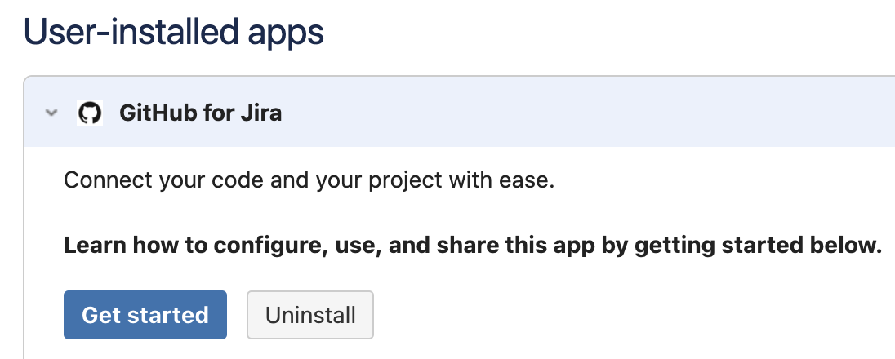

# GitHub For Jira

## About

Connect your GitHub code with your project management in Jira. A separate Jira subscription is required. With two of your most important tools connected, you'll spend less time managing projects and more time working on them. This integration is an open source project, built and maintained by [Atlassian](https://atlassian.com).

## Table of Contents
- [Installation and setup](#installation-and-setup)
  - [Requirements](#requirements)
  - [Installation](#installation)
  - [Connecting your GitHub Organization](#connecting-your-github-organization-to-jira)
  - [Authorization](#authorization)
- [Using the integration](#using-the-integration)
  - [Development information in Jira](#development-information-in-jira)
  - [Take action using Smart Commits](#take-action-using-smart-commits)
  - [Link issues in GitHub](#link-issues-in-github)
  - [Manage Jira Subscriptions](#manage-jira-subscriptions)
- [Migrating from the DVCS connector](#migrating-from-the-dvcs-connector)
- [Need help?](#questions-need-help)
- [Contributing](#contributing)
- [License](#license)

--------

## Installation and setup

### Requirements
This app officially supports GitHub.com and Jira Cloud. Support for GitHub Enterprise and/or Jira server may be considered in the future.

### Installation from Atlassian
1. Sign in to your Jira Cloud account.
2. From the top navigation bar in Jira, select **Apps** -> **Find new Apps**. You can also click the **Gear Icon** in the top-right corner and select **Apps**. 
3. Search for **GitHub for Jira** and Click **Get app**

7. Click the **Get Started** button to connect your GitHub account.

Next you will need to [connect your GitHub organization to Jira](#connecting-your-github-organization-to-jira).

### Installation from GitHub Marketplace
1. Go to https://github.com/marketplace/jira-software-github.
2. Complete the (free) order for your GitHub Organization.
3. On the installation settings screen, choose which repositories you want to use with the Jira Integration and press **Install**.
4. Once installation completes, if we can't detect your Jira site, you will be prompted to enter a url, otherwise you will be redirected to the Jira marketplace to install the GitHub for Jira app.
5. When you reach the page in marketplace, simply click **Get Started**.

### Connecting your GitHub organization to Jira
As part of the installation flow, you should be directed to configure your GitHub organizations in the Jira app. In your Jira instance, in the `Manage Apps` section, click on `Get Started` under GitHub for Jira.  This will bring you to the app's configuration screen.  Click `Connect GitHub organization` and follow the steps to install the app on GitHub and allow it permission to view your repos. You can also manage existing connections or add additional organizations any time on this same screen.

#### Selecting GitHub repositories
If you originally gave the app access to "All repositories", and you've created a new repository on GitHub after installing the GitHub integration for Jira, your new repository will automatically work with the integration. If you installed the app on a subset of repositories, you will need to manually edit your repository selection by:
1. Sign in into your Jira Cloud account
2. From the top navigation bar in Jira, select **Apps** -> **Manage your apps** -> **GitHub for Jira** -> **Get started**
3. Select **Configure** next to the relevant GitHub organization and add the new repository you want the app to integrate with.

### Authorization
By granting the app access, you are providing the following authorizations to your GitHub and Jira accounts:

#### Jira Permission Scopes
Read, Write, and Admin for Development Information (branches, commits, and pull requests)

#### GitHub Permission Scopes

|Permission scope|Why we need it|
|---|---|
|**Read** access to code & metadata | To sync development information to Jira|
|**Read** and **write** access to issues and pull requests| To power Smart Commit actions and unfurl Jira URLs|
|**Read** and **write** access to actions and deployments| To sync CI/CD (GitHub Actions) information to Jira|

## Using the integration

### Development information in Jira
To start seeing your development information from GitHub in Jira, you'll need to start using Smart Commits. Smart Commits are documented on the [Atlassian site](https://confluence.atlassian.com/jirasoftwarecloud/processing-issues-with-smart-commits-788960027.html) but you'll have to simply make sure a Jira issue is a part of the commit message. For example: `[JRA-123] fix typo` will be sent through to Jira and appear in the Development Information section of the Jira issue with the key `JRA-123`. Any branch, commit, pull request, build and deployment linked to this commit will now appear in Jira. 

> example

### Link issues in GitHub
If an issue body contains a valid Jira issue key on your instance, the integration will automatically expand it into a reference link when surround in brackets `[]`. For example: `[JRA-123]` will be turned into a link to `https://<your-instance>.atlassian.net/browse/JRA-123` . Markdown references are only visible when editing an Issue/PR comment, and appear at the bottom of the text area:

This makes it so Jira issues can be linked inside a comment without it interrupting the flow of the comment as a whole.

### Manage Jira Subscriptions

Admins of an installation can view and delete subscriptions to other Jira instances, without having to log in to the Jira instance itself:

This is useful if your installation is setup to send Development information to an instance you no longer have access to, or to audit instances other admins in your org may have previously configured. This only gives you the permission to delete the connection, and will not give you access to the instance itself. You will still need to be granted access in Jira if you want to be able to view the Development information that's been sent to that instance.

## Migrating from the DVCS connector
Existing users of Jira's built-in DVCS connector that meet the [requirements](#requirements) should migrate to this integration. If you've not yet been prompted to do so, you can manually kick off the migration by:
1. Sign into your Jira Cloud account
2. From the left sidebar in Jira, select Jira Settings -> Applications -> DVCS accounts.
3. Follow the prompt to upgrade your GitHub connection

## Questions? Need help?
Take a look through the [troubleshooting steps in our support guide](SUPPORT.md).

## Contributing
Want to help improve the integration between GitHub and Jira? Check out the [contributing docs](CONTRIBUTING.md) to get involved.

## License
The project is available as open source under the terms of the [MIT License](LICENSE).

When using the GitHub logos, be sure to follow the [GitHub logo guidelines](https://github.com/logos).
