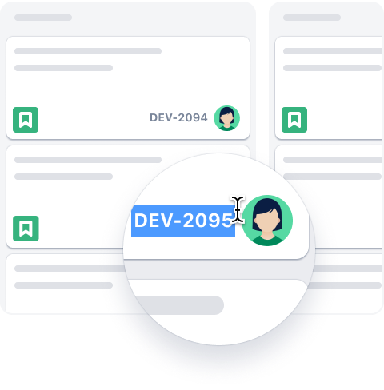
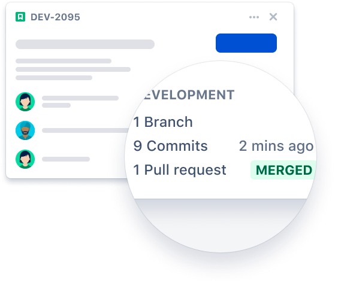

# GitHub For Jira

## About

Connect your GitHub code with your project management in Jira. A separate Jira subscription is required. With two of
your most important tools connected, you'll spend less time managing projects and more time working on them. This
integration is an open-source project, built and maintained by [Atlassian](https://atlassian.com).

## Support

For general support inquiries and bug reports, [please contact the Atlassian Support team](https://support.atlassian.com/contact/#/?inquiry_category=technical_issues&is_cloud=true&product_key=jira-software).  For feature requests, [please create a new issue](https://github.com/atlassian/github-for-jira/issues/new).

## Table of Contents
  - [Install app](#install-app)
    - [Requirements](#requirements)
    - [Install from Jira Cloud site](#install-from-jira-cloud-site)
    - [Install from Atlassian Marketplace](#install-from-atlassian-marketplace)
    - [Install from GitHub Marketplace](#install-from-github-marketplace)
  - [Configure app](#configure-app)
    - [Connect your GitHub organization to Jira](#connect-your-github-organization-to-jira)
    - [Connect new GitHub repositories](#connect-new-github-repositories)
  - [Manage app](#manage-app)
    - [Authorize](#authorize)
      - [Jira permission scopes](#jira-permission-scopes)
      - [GitHub permission scopes](#github-permission-scopes)
        - [Repository Permissions](#repository-permissions)
        - [Organization permissions](#organization-permissions)
        - [Events Our App Subscribes To](#events-our-app-subscribes-to)
    - [Manage Jira subscriptions](#manage-jira-subscriptions)
  - [Send data and use the integration](#send-data-and-use-the-integration)
    - [See GitHub development information in Jira](#see-github-development-information-in-jira)
    - [See Jira issues in GitHub](#see-jira-issues-in-github)
    - [See GitHub builds and deployments in Jira](#see-github-builds-and-deployments-in-jira)
    - [How the integration works](#how-the-integration-works)
    - [How the backfill works](#how-the-backfill-works)
  - [Migrate from the DVCS Connector](#migrate-from-the-dvcs-connector)
  - [Enterprise Features](#enterprise-features)
    - [IP Allow List](#ip-allow-list)
    - [Known issues](#known-issues)
      - [Connecting GitHub organizations with SSO](#connecting-github-organizations-with-sso) 
  - [Need help?](#need-help)
  - [Contribute](#contribute)
  - [License](#license)

## Install app

### Requirements
This app officially supports GitHub.com (all editions including Enterprise) and Jira Cloud. Support for GitHub Enterprise Server
and/or Jira server may be considered in the future.

### Install from Jira Cloud site

This is the recommended approach to install the app into your Jira site and GitHub org.

1. Sign in to your Jira Cloud account.
2. From the top navigation bar in Jira, select **Apps > Find new Apps**. You can also click the **Gear icon** in
   the top-right corner and select **Apps**.
3. Search for **GitHub for Jira** and select **Get app**
4. When the app is installed, a flag will pop up in the top-right corner. Click **Get Started** to connect your GitHub
   account. If you missed this flag, click **Configure integration** from the Apps menu.

Next, you will need to [configure the app](#configure-app).

## Install from Atlassian Marketplace

1. Go to [Atlassian Marketplace](https://marketplace.atlassian.com/apps/1219592/github-for-jira?hosting=cloud&tab=overview).
2. Sign in to your Atlassian account and click **Get it now**.
3. Select your site to install this app, click **Install app**.
4. You will be taken to the app listing on your Jira site, click **Get app**.
5. When the app is installed, a flag will pop up in the top-right corner. Click **Get Started** to connect your GitHub
   account. If you missed this flag, click **Configure integration** from the Apps menu.

Next, you will need to [configure the app](#configure-app).

### Install from GitHub Marketplace
1. Go to https://github.com/marketplace/jira-software-github.
2. Complete the (free) order for your GitHub Organization.
3. Choose which repositories you want to use with the Jira Integration on the installation settings screen, and click
   **Install**.
4. You will be directed to a setup page to select your Jira site.
5. Once installation completes you will be redirected to [Atlassian Marketplace](https://marketplace.atlassian.com/apps/1219592/github-for-jira?hosting=cloud&tab=overview) to install the GitHub for Jira app.
6. From there, follow the instructions above to [install from Atlassian Marketplace](#install-from-atlassian-marketplace).

## Configure app

### Connect your GitHub organization to Jira
As part of the installation flow, you should be directed to a **GitHub configuration** screen to configure your GitHub
organizations in the Jira app.

> :warning: If you are not directed, navigate to the Apps page of your Jira instance and click **Configure integration** under the ”GitHub” heading. If you do not see this, click on **Manage your apps** and **Get started** under GitHub for Jira (only visible for Jira admins). This will bring you to the app's configuration screen.

Select **Connect GitHub organization**, then select either **GitHub Cloud** or **GitHub Enterprise Server**.

- If you select **GitHub Cloud**, you’ll be redirected to a page where you can connect to organizations in GitHub.

- If you select **GitHub Enterprise Server**, you’ll need to provide the URL for your server and create a GitHub app.

On the Connect a GitHub organization page, select the organization and repositories you'd like to connect.

> :warning: If you don’t see your organization click **Install Jira on a new organization** and follow the steps to [install the app on GitHub](#install-app) and allow it permission to view your repositories. You can also manage existing connections or add additional organizations at any time on this same screen.

For detailed instructions on how to connect to Cloud or Server, read our [support documentation](https://support.atlassian.com/jira-cloud-administration/docs/integrate-with-github/).

### Connect new GitHub repositories
If you originally gave the GitHub for Jira app access to "All repositories", and you've created a new repository on GitHub after configuration, your new repository will automatically work with the integration. However, if you installed the app on a subset of repositories, you will need to manually edit your repository selection by:

1. Sign in to your Jira Cloud account
2. From the top navigation bar in Jira, select **Apps > Manage your apps - GitHub for Jira > Get started**.
3. Select **Configure** next to the relevant GitHub organization and add the new repository you want the app to integrate with.

## Manage app

### Authorize
By granting the app access, you are providing the following authorizations to your GitHub and Jira accounts:

#### Jira permission scopes
Read, Write, and Admin for Development Information (branches, commits, and pull requests) as well as read for Security Information (Dependabot, Code Scanning, and Secret Scanning).

#### GitHub permission scopes

##### Repository Permissions

| **Permission scope**                                           | **Why the app needs it**                                                                                                                                                                                                                                                                                                                                                                                                                                                                                                                                                                                                                                                                                                                                                                                                                                                                                                                                                                                         |
|----------------------------------------------------------------|------------------------------------------------------------------------------------------------------------------------------------------------------------------------------------------------------------------------------------------------------------------------------------------------------------------------------------------------------------------------------------------------------------------------------------------------------------------------------------------------------------------------------------------------------------------------------------------------------------------------------------------------------------------------------------------------------------------------------------------------------------------------------------------------------------------------------------------------------------------------------------------------------------------------------------------------------------------------------------------------------------------|
| **Read-only** access to actions                                | Read-only access to actions exposes the `workflow_run` webhook event. This event includes information such as artifacts_url, check_suite_id, conclusion, head_branch, and head_sha.                                                                                                                                                                                                                                                                                                                                                                                                                                                                                                                                                                                                                                                                                                                                                                                                                              |
| **Read-only** access to code scanning alerts / security events | If you want to see links to GitHub code scanning alerts in Jira or see your code scanning alerts as part of Security in Jira, the app will need read permissions to Security events. The GitHub App will listen to [`code_scanning_alert`](https://docs.github.com/en/developers/webhooks-and-events/webhooks/webhook-events-and-payloads#code_scanning_alert) webhooks and send details of the Security reports to Jira. These will appear under the "Other links" tab of the Development Panel on Jira issues as well as in the Security in Jira vulnerability table.                                                                                                                                                                                                                                                                                                                                                                                                                                          |
| **Read-only** access to dependabot alerts                      | If you want to see your dependabot alerts in Security in Jira, the app will need read permissions for dependabot alerts. The GitHub App will listen to [`dependabot_alert`](https://docs.github.com/en/webhooks/webhook-events-and-payloads#dependabot_alert) webhooks and send details of the Security reports to Jira. These will appear in the Security in Jira vulnerability table.                                                                                                                                                                                                                                                                                                                                                                                                                                                                                                                                                                                                                          |
| **Read-only** access to secret scanning alerts                 | If you want to see your secret scanning alerts in Security in Jira, the app will need read permissions for secret scanning alerts. The GitHub App will listen to [`secret_scanning_alert`](https://docs.github.com/en/webhooks/webhook-events-and-payloads#secret_scanning_alert) webhooks and send details of the Security reports to Jira. These will appear in the Security in Jira vulnerability table.                                                                                                                                                                                                                                                                                                                                                                                                                                                                                                                                                                                                           |
| **Read-only** access to deployments                            | If you want to see build and deployment information in Jira, the app will need read permissions for deployments. This will allow the integration to listen to the webhook `deployment_status` event which occurs when a deployment is created. Read-only deployment permissions are used for the following webhooks:   - deployment status                                                                                                                                                                                                                                                                                                                                                                                                                                                                                                                                                                                                                                                                    |
| **Read-only** access to metadata                               | **Metadata** All GitHub apps have read-only metadata permission set by default. This is a [mandatory requirement by GitHub](https://docs.github.com/en/rest/reference/permissions-required-for-github-apps#metadata-permissions) and is needed to provide access to a collection of read-only endpoints with metadata for various resources. These endpoints do not provide sensitive private repository information. Read-only metadata permissions are used for the following webhook:   - repository                                                                                                                                                                                                                                                                                                                                                                                                                                                                                                       |
| **Read** and **write** access to issues and pull requests      | **Issues** and **pull requests** are used by the GitHub for Jira app to power Smart Commit actions and unfurl Jira URLs. "Unfurling" means that the app looks for Jira issue keys **in square brackets** like `[ABC-123]` in pull request or issue comments and then replaces those issue keys with a link to the respective Jira issue.    **Issues:** Read and write issue permissions are used for the following webhooks:   - issue comment   - issues    **Pull requests:** Read and write pull request permissions are used for the following webhooks:   - pull request   - pull request review.     *Notes:* <ol><li>The square brackets are required, without which the pull request may appear in the Jira issue's Development section, but the issue key won't be expanded to a link.</li><li>For GitHub Enterprise integration (where the user owns the GitHub app) "Write" permission is optional. When not provided, the "unfurl" logic is gently skipped.</li></ol> |
| **Read** and **write** access to contents                      | **Contents (aka code):** Read-only permissions are needed to sync development information to Jira for the following webhooks:   - commit comment   - delete   - push   - workflow run    We need write permissions for the **create** webhook so you have the ability to create a branch from an issue's dev panel.   *Note:* for GitHub Enterprise integration (where the user owns the GitHub app) "Write" permission is optional. When not provided, the "Create Branch" feature will not function.                                                                                                                                                                                                                                                                                                                                                                                                                                                                                   

##### Organization permissions

| **Permission scope**         |**Why the app needs it**|
|------------------------------|---|
| **Read-only** access to members | To determine if you have admin access to a GitHub organization.|

##### Events Our App Subscribes To

| **Event**                             | **When this event occurs**                                                                                  |
|---------------------------------------|-------------------------------------------------------------------------------------------------------------|
| Code scanning alert / security events | Code Scanning alert created, fixed in branch, or closed                                                     |
| Commit comment                        | A commit comment is created                                                                                 |
| Create                                | A Git branch or tag is created                                                                              |
| Delete                                | A Git branch or tag is deleted                                                                              |
| Dependabot alert                      | Dependabot alert auto_dismissed, auto_reopened, created, dismissed, reopened, fixed, or reintroduced.       |
| Deployment status                     | A deployment is created                                                                                     |
| Issue comment                         | Activity related to an issue or pull request comment                                                        |
| Issues                                | Activity related to an issue                                                                                |
| Pull request                          | Activity related to pull requests                                                                           |
| Pull request review                   | Activity related to pull request reviews                                                                    |
| Push                                  | One or more commits are pushed to a repository branch or tag                                                |
| Repository                            | Activity related to a repository                                                                            |
| Secret scanning alert                 | Secret scanning alert created, resolved, or reopened                                                                           |
| Workflow run                          | When a GitHub Actions workflow run is requested or completed                                                |

Have more questions about permissions? Please see our [FAQ documentation](https://github.com/atlassian/github-for-jira/blob/main/docs/FAQs.md). If you can’t find the answer to a question, please feel free to [open an issue](https://github.com/atlassian/github-for-jira/issues/new) and send your question to our team. We’ll be more than happy to answer and will update our FAQ doc accordingly.

### Manage Jira subscriptions
Additionally, admins of an installation can view and delete GitHub subscriptions to other Jira instances, without having to log in to the Jira instance itself. This is useful if your installation is set up to send Development information to a Jira instance you no longer have access to, or to audit instances that other admins in your org may have previously configured.

To navigate to your Jira subscriptions

1. Click **Connect GitHub organization**.
2. Click the **edit icon** next to the organization.

> :information_source: This only gives you permission to delete the connection to Jira instances. To view development information in that Jira instance, you’ll need to be granted access in Jira.

## Send data and use the integration
### See GitHub development information in Jira
To start seeing your development information from GitHub in Jira, simply add a Jira issue key to your commit message, branch name, or PR title.

For example: the text `[DEV-2095]` will be sent through to Jira and appear in the Development Information section of the Jira issue with the key `DEV-2095`. Any branch, commit, pull request, build and deployment linked to this commit will now appear in Jira. You can find more information on how to reference issues in your development work [here](https://support.atlassian.com/jira-software-cloud/docs/reference-issues-in-your-development-work/).

### See Jira issues in GitHub
If an issue body contains a valid Jira issue key on your instance, the integration will automatically expand (unfurl) it into a reference link when surrounded in brackets `[]`. For example: [DEV-2095] will be turned into a link to `https://<your-instance>.atlassian.net/browse/DEV-2095`.

This makes it so Jira issues can be linked inside a comment without it interrupting the flow of the comment as a whole.

**Note:** The square brackets are required, without which the pull request may appear in the Jira issue's Development section, but the issue key won't be expanded to a link.

### See GitHub builds and deployments in Jira
GitHub Actions workflows and deployments will automatically be sent to your connected Jira instances so that they will be visible in Jira issues. If you’re setting this up for the first time, follow [GitHub Actions Documentation - GitHub Docs](https://docs.github.com/en/actions). If you already have GitHub Actions and want to see CI/CD data from GitHub in Jira, include the Jira issue key in your commit message, branch name, or PR title.

Also see our guides for [builds](./docs/builds.md) and [deployments](./docs/deployments.md).

### See GitHub security alerts in Jira
Dependabot, code scanning and secret scanning alerts in GitHub will be sent to Jira allowing your team to track vulnerabilities in Jira, and create Jira issues to help manage security work.

[Learn more about the Security in Jira feature](https://support.atlassian.com/jira-cloud-administration/docs/what-is-the-security-feature/).

### How the integration works
When a workflow (e.g. GitHub Action), development event (e.g. pull request, commit, branch) or security event (e.g. dependabot, code scanning or secret scanning alert) runs, the app receives a webhook from GitHub. For development information the app then extracts the issue key from the respective branch/commit/PR and send this information to Jira, for security alerts no issue keys are needed.

## How the backfill works
The app is designed to backfill historical data into Jira. Once you have installed and configured the app successfully,
it will automatically trigger the backfilling process, for 6 months, for the allowed repositories to update Jira with historical information such as pull requests, deployments, branches, builds, commits and security alerts. Once the initial backfilling process is complete, you will be able to view the backfilled date and status on the user interface. All branches will be backfilled, regardless of their creation date. However, pull requests, deployments, builds, commits and security alerts will only be backfilled for the last six months. If you wish to pull more historical data in Jira, you may continue the backfill process for older dates by selecting 'Continue backfill' from the action menu. If the historical data is substantial, we recommend backfilling your data in 6 month segments, and continuing the process until you've reached the desired backfilled date. 

The historical data that meets the following criteria will be available in Jira:
1. The backfilling process attempts to connect all branches that fulfill at least one of the following criteria:
    - The branch name contains the issue key.
    - The title of the latest pull request associated with the branch contains the issue key.
    - The last commit message of the branch contains the issue key.
2. All commits from the default branch will be backfilled. The commit message must contain the Jira issue key.
3. Only the latest 50 commits from non-default branches will be backfilled.
4. Unreachable commits (e.g. from deleted branches) will NOT be backfilled.
5. All pull requests, regardless of their statuses, will be backfilled. The Jira issue key should be included either in 
   the title of the pull request, in the description of the pull request or in the name of the source branch 
   of the pull request.
6. All the builds and deployments data will be backfilled that contain the issue keys. You can check how to include 
   issue keys to the builds and deployments [here](#see-github-builds-and-deployments-in-jira).
7. All dependabot, code scanning and secret scanning alerts that appear on main or protected branches will be backfilled. 

If an error occurs during the backfilling process, the app will prompt you to retry the backfilling for the failed repositories without having to restart the entire backfill process. However, this does not account for permission errors. You will need to resolve any permissions errors before retrying the backfill process.

## Migrate from the DVCS Connector
Existing users of Jira's built-in DVCS connector that meet the [requirements](#requirements) should migrate to this integration. If you've not yet been prompted to do so, you can manually kick off the migration by:

1. Sign in to your Jira Cloud account.
2. From the left sidebar in Jira, select **Jira Settings > Applications > DVCS accounts**.
3. Follow the prompt to upgrade your GitHub connection.

## Enterprise Features

### IP Allow List

GitHub has the ability to limit who can communicate with your organization's GitHub API which we now fully support.
To enable this feature or to debug any issues, please refer to our [GitHub IP Allow List documentation](./docs/ip-allowlist.md).

### Known issues

#### Connecting GitHub organizations with SSO

If a GitHub organization is [protected with SAML](https://docs.github.com/en/enterprise-cloud@latest/organizations/managing-saml-single-sign-on-for-your-organization/about-identity-and-access-management-with-saml-single-sign-on),
you might find its "Connect" button disabled. This may happen in a scenario
when the user token (which GitHub for Jira app's UI is using) [does not have permissions to access the protected org](https://docs.github.com/en/enterprise-cloud@latest/authentication/authenticating-with-saml-single-sign-on/about-authentication-with-saml-single-sign-on#about-oauth-apps-github-apps-and-saml-sso),
because it was issued and saved to the app's session when the user didn't have an active SAML session in GitHub
in the browser.

To workaround the problem, perform the following:
- create an active SAML session by going to `https://github.com/organizations/<YOUR-ORG-NAME>/settings`
    - that should initiate an auth process with your SSO identity provider
- in the same browser window, go to GitHub for Jira app and find the disabled "Connect" button for `<YOUR-ORG-NAME>` GitHub org
    - it must be located either on one of these pages
        - `https://github.atlassian.com/github/configuration` for GitHub cloud, or
        - `https://github.atlassian.com/github/<UUID>/configuration` for GitHub server enterprise
 - insert `resetGithubToken=true` query parameter to the URL of the page in the browser and reload it
    - `https://github.atlassian.com/github/configuration?resetGithubToken=true` for GitHub cloud, or
    - `https://github.atlassian.com/github/<UUID>/configuration?ghRedirect=to&resetGithubToken=true` for GitHub server enterprise

After doing that, the token will be re-issued by GitHub with all necessary permissions and saved in the app's session, 
and "Connect" button should become enabled.

## Need help?
Take a look through the troubleshooting steps in our [support guide](./SUPPORT.md).

## Contribute
Want to help improve the integration between GitHub and Jira? Check out the [contributing docs](./CONTRIBUTING.md) to get involved.

## License
The project is available as open source under the terms of the [MIT License](./LICENSE).

When using the GitHub logos, be sure to follow the [GitHub logo guidelines](https://github.com/logos).
