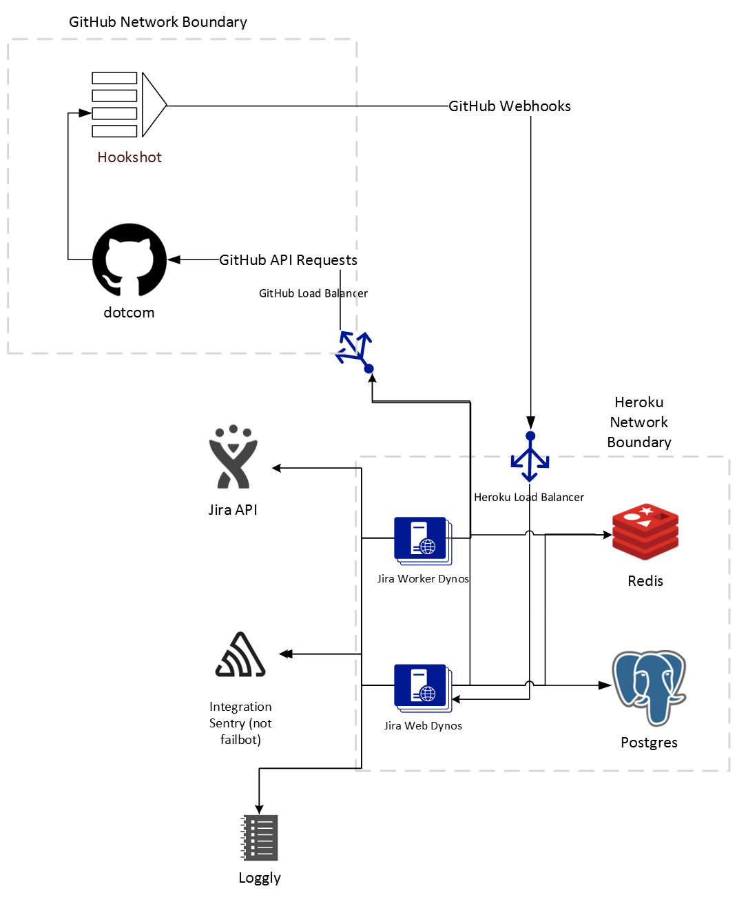

# Architecture

## Simple Network Diagram

Below is a point-in-time network diagram of the Jira Application Deployment attempting to capture the most
important sections of how and where network resources are and what the connections are.

