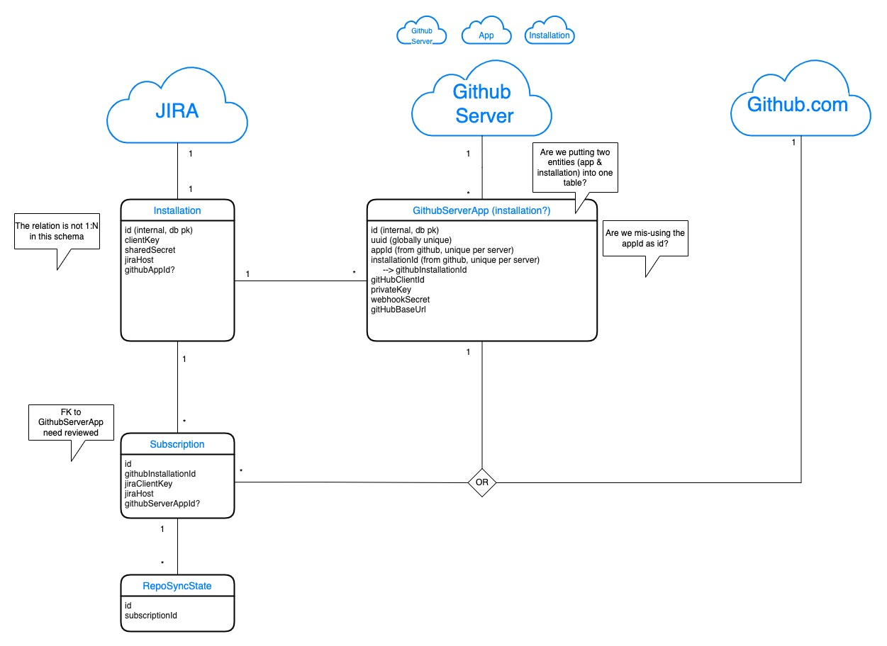

# GitHub for Jira Data Model

[draw.io file](./draw.io/data-model.drawio.xml)

GitHub for Jira used to only integrate between Jira and GitHub.com, but with the added support for GitHub Enterprise Server (coming soon), we must be able to handle multiple GitHub apps to a single Jira instance.  This data model is to try to clarify the interactions between these entities and its evolution as we continue to develop the integration.

This model doesn't consider all data that's stored in each entity, only those relevant to create the connections between entities.

### Installation

Installations are only specific to the Jira app, 1 per Jira instance.  It holds the `clientKey`, `encryptedSharedSecret` and `jiraHost` given to us by the Connect install webhook - `clientKey` is the cloud id and can be used as an identifier for logs as the `jiraHost` is considered to be User Generated Content.

### GitHubServerApp

Each GitHub App created in a GitHub Enterprise Server instance is added to this table to keep track of them.  A Github app _can only be associated with one Jira instance_ to limit access and prevent data leaking to the wrong customer.  This means that each new Jira instance needs to create at least one GHE app.

Each App will have access to many Organizations under it and we much show all results to the users when needed, which means multiple API calls. We do not hold the GitHub Cloud app in this table since we need it as a default, but still use the same data structure in the code.  

### Subscription

When you add a GitHub Organization to the integration, a `Subscription` is created to link the Jira app to the Org through a GitHub App (cloud or server).  A Jira instance can have an unlimited amount of Subscriptions for each Org added.

### RepoSyncState

When backfilling a GitHub Organization, we keep the state of each Repository within that Org as to where they are in the process.