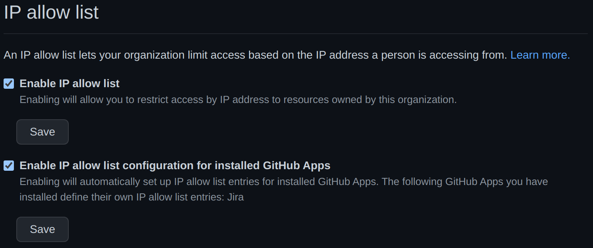

# GitHub IP allow list configuration

If your organization is using [GitHub's organization IP allow list](https://docs.github.com/en/organizations/keeping-your-organization-secure/managing-allowed-ip-addresses-for-your-organization) feature, it needs to
be configured properly for the GitHub for Jira app to be able to communicate with your organization's GitHub API.

> :warning: **Issue with IP allowlists**! Currently, there is an issue with IP allow lists where GitHub blocks some requests to the API even if the correct IP addresses are listed in the allow list. To work around this problem, please follow the steps in the section "[Manually setting the allowed IP addresses](#manually-setting-the-allowed-ip-addresses)". Make sure you add each IP address as an individual entry to the allow list (i.e. not as a CIDR range), because it will not work otherwise.

## IP address range

The servers of the GitHub for Jira app operate following Atlassian defined IP addresses. Please refer to the support documentation on the specific ranges: https://support.atlassian.com/organization-administration/docs/ip-addresses-and-domains-for-atlassian-cloud-products/

## Automatically load IP addresses from the GitHub for Jira app

We maintain the list of IP addresses the GitHub for Jira app's servers operate from in the GitHub app itself. You can automatically use this list by enabling "IP allow list configuration for installed GitHub Apps" as follows:

- as an admin go to your GitHub org page at `https://github.com/<your org>`
- go to the `Settings` tab 
- in the sidebar, select `Organization security` 
- scroll down to the `IP allow list` section
- enable the checkbox `Enable IP allow list configuration for installed GitHub Apps`
- don't forget to hit the save button under the checkbox.

Your GitHub organization is now accessible from the GitHub for Jira app's servers. If the IP addresses change, your IP allow list will be automatically updated.

## Manually setting the allowed IP addresses

If you don't want to automatically update your IP allowlist from the list we maintain, you can add the IP addresses manually like this:

- as an admin go to your GitHub org page at `https://github.com/<your org>`, 
- go to the `Settings` tab, 
- then in the sidebar, select `Organization security`
- scroll down to the `IP allow list` section
- click the `+ Add` button to add an IP address
- repeat this for all IP addresses in the range mentioned at the start of the page.

Your GitHub organization is now accessible from the GitHub for Jira app's servers. Note that if the IP addresses change, you will have to update them manually.

## If problems persist

Feel free to [contact Atlassian support](https://support.atlassian.com/contact/#/?inquiry_category=technical_issues&is_cloud=true&product_key=third-party-product) for guidance and extra help.
