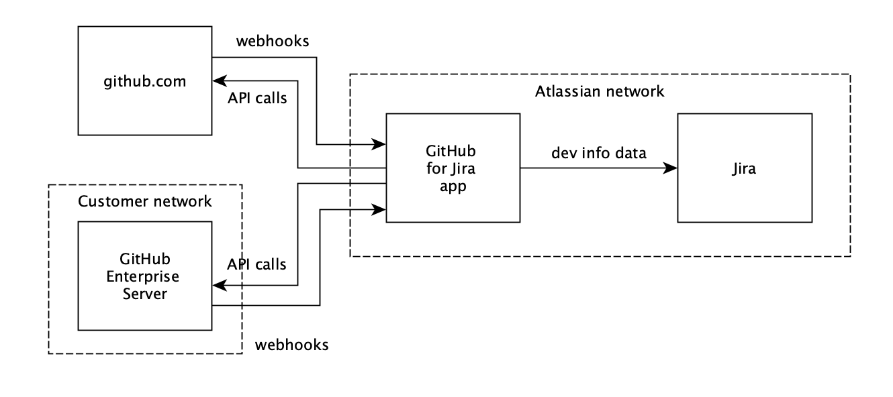

# Security FAQ

The GitHub for Jira app integrates both github.com repositories and GitHub Enterprise Server repositories with Jira. This document gives an overview of some security and data aspects.

## Architecture overview

The GitHub for Jira app connects your github.com or GitHub Enterprise Server repositories with your Jira Cloud sites. This diagram shows the main data flows:

github.com / GitHub Enterprise Server sends webhook events to the GitHub for Jira app when something happens in GitHub, for example:

- a developer pushed a commit
- a developer created a new branch
- a GitHub Action build was triggered
- ...

The GitHub for Jira app then checks if these events contain a reference to an existing Jira issue in one of your Jira projects. If yes, it forwards these events to Jira so that they become visible in Jira.

Additionally, the GitHub for Jira app makes requests to the GitHub API to enrich the data of the webhooks. For this, the app needs permissions to access your GitHub organization’s data.

In the rest of this document, we’ll answer some security-related questions around this architecture.

## Integration mechanism

To integrate with GitHub, the GitHub for Jira app makes use of the concept of a [GitHub app](https://docs.github.com/en/developers/apps/getting-started-with-apps/about-apps). A GitHub app defines a set of permissions, secrets, and other metadata. When you install a GitHub app into your GitHub organization, you are granting those permissions to the app so that the app can access your organization’s resources.

> :cloud: **GitHub Cloud**
> 
> When setting up a connection between Jira and a github.com organization, you will be asked to install the GitHub app named “Jira” into your organization.

> :office: **GitHub Server**
> 
> When setting up a connection between Jira and an organization in a GitHub Server Enterprise instance, you will be asked to create a custom GitHub app on your GitHub Server instance.

To integrate with Jira, the GitHub for Jira app makes use of Atlassian’s [Connect](https://developer.atlassian.com/cloud/jira/platform/security-for-connect-apps/) integration mechanism. This shares a secret between Jira and the app to give it access to the Jira API. You can view the app’s [Connect descriptor](https://github.atlassian.com/jira/atlassian-connect.json) to get an overview of the permissions etc.

## What permissions does the GitHub for Jira app require?

The GitHub for Jira app requires the following permissions on your GitHub data to operate:

| Permission scope                                                                                                                                                                                                                                                     | Why the app needs it                                                                                                                                                                                                                                                                                                                                                                                     |
|----------------------------------------------------------------------------------------------------------------------------------------------------------------------------------------------------------------------------------------------------------------------|----------------------------------------------------------------------------------------------------------------------------------------------------------------------------------------------------------------------------------------------------------------------------------------------------------------------------------------------------------------------------------------------------------|
| Read-only access to [actions](https://docs.github.com/en/rest/overview/permissions-required-for-github-apps#permission-on-actions                                                                                                                                    | The app needs read access to the GitHub workflow APIs to support sending build and deployment events from your GitHub Actions workflows to Jira.                                                                                                                                                                                                                                                         |
| Read-only access to code scanning alerts                                                                                                                                                                                                                             | The app needs read access to the [Code Scanning APIs](https://docs.github.com/en/rest/code-scanning) to support sending code scanning events to Jira.                                                                                                                                                                                                                                                    |
| Read-only access to dependabot alerts                                                                                                                                                                                                                                | The app needs read access to the [Dependabot APIs](https://docs.github.com/en/rest/dependabot) to support sending dependabot events to Jira.                                                                                                                                                                                                                                                             |
| Read-only access to secret scanning alerts                                                                                                                                                                                                                           | The app needs read access to the [Secret Scanning APIs](https://docs.github.com/en/rest/secret-scanning) to support sending secret scanning events to Jira.                                                                                                                                                                                                                                              |
| Read-only access to [contents](https://docs.github.com/en/rest/overview/permissions-required-for-github-apps#permission-on-contents)                                                                                                                                 | To get access to commits and other resources, for example to search for Jira issue keys in historical commits and send them to Jira (we call this process “backfilling”).                                                                                                                                                                                                                                
| Read-only access to [deployments](https://docs.github.com/en/rest/overview/permissions-required-for-github-apps#permission-on-deployments)                                                                                                                           | The app needs to read deployments to support sending deployment events to Jira. This is permission is only used when you are using [GitHub deployments](https://github.com/atlassian/github-for-jira/blob/main/docs/deployments.md).                                                                                                                                                                     
| Read-only access to metadata                                                                                                                                                                                                                                         | All GitHub apps have read-only metadata permission set by default. This is a [mandatory requirement by GitHub](https://docs.github.com/en/rest/reference/permissions-required-for-github-apps#metadata-permissions) and is needed to provide access to a collection of read-only endpoints with metadata for various resources. These endpoints do not provide sensitive private repository information. 
| Read and write access to [issues](https://docs.github.com/en/rest/overview/permissions-required-for-github-apps#permission-on-issues) and [pull requests](https://docs.github.com/en/rest/overview/permissions-required-for-github-apps#permission-on-pull-requests) | The app reads new issues and pull requests to check them for Jira issue keys. If there is a key, it will make them visible in the corresponding Jira issue. The app also replaces valid Jira issue keys in issue and pull request descriptions with a link to the corresponding Jira issue (“unfurling”). For this, the app requires write access.                                                       |
| Read-only access to [members](https://docs.github.com/en/rest/overview/permissions-required-for-github-apps#permission-on-members)                                                                                                                                   | The needs read access to the members of your GitHub organizations to determine whether they are an admin of the org or not. Only admins are allowed to change the configuration of the GitHub for Jira app.                                                                                                                                                                                              |

The GitHub for Jira app has `READ`, `WRITE`, and `DELETE` permissions on the Jira API. The permissions to the Jira API cannot be finer grained, at the moment, so that these permissions are scoped across the whole Jira API.

## Can I revoke some of the app’s permissions if we’re not using the feature that needs them?

> :cloud: **GitHub Cloud**
>
> If you use the GitHub for Jira app with github.com, sadly you cannot control the permissions granularly. GitHub apps don’t give users control over which permissions they want to allow. When you install a GitHub app into an organization, you either accept all permissions of the app, or none (and then you can’t use the app at all).

> :office: **GitHub Server**
>
> If you use the GitHub for Jira app with a GitHub Enterprise Server instance that you control yourself, you create your own GitHub app on that server instance which means that you can define which permissions you want to give to that app.
>
> If you don’t grant the app all permissions you should expect that some features will not work.

## What webhooks does the GitHub for Jira app consume?

| Event                                                                                                                                     | Why the app needs it                                                                                                                                                                                                                                                                                                   |
|-------------------------------------------------------------------------------------------------------------------------------------------|------------------------------------------------------------------------------------------------------------------------------------------------------------------------------------------------------------------------------------------------------------------------------------------------------------------------|
| [Code scanning alert](https://docs.github.com/en/developers/webhooks-and-events/webhooks/webhook-events-and-payloads#code_scanning_alert) | When a code scanning alert is created or updated in GitHub it will be sent to Jira and show in the Security in Jira vulnerability table. If the alert has an issue key it forwards this event to Jira so that the code scanning alert becomes visible on the corresponding Jira issues.                                |
| [Commit comment](https://docs.github.com/en/developers/webhooks-and-events/webhooks/webhook-events-and-payloads#commit_comment)           | Do we really need this webhook? I couldn’t find any code that is calling that API!                                                                                                                                                                                                                                     |
| [Create](https://docs.github.com/en/developers/webhooks-and-events/webhooks/webhook-events-and-payloads#create)                           | When a GitHub user creates a new branch or tag, the GitHub for Jira app searches the branch or tag name for a Jira issue key and sends the branch/tag to Jira to make it visible in the associated Jira issues.                                                                                                        |
| [Dependabot alert](https://docs.github.com/en/webhooks/webhook-events-and-payloads#dependabot_alert)                                      | When a dependabot alert is created or updated in GitHub it will be sent to Jira and show in the Security in Jira vulnerability table.                                                                                                                                                                                  |
| [Delete](https://docs.github.com/en/developers/webhooks-and-events/webhooks/webhook-events-and-payloads#delete)                           | When a GitHub user deletes a new branch or tag, the GitHub for Jira app removes this branch or tag from any Jira issues that might have been associated with it.                                                                                                                                                       |
| [Deployment status](https://docs.github.com/en/developers/webhooks-and-events/webhooks/webhook-events-and-payloads#deployment_status)     | When a [GitHub deployment](https://github.com/atlassian/github-for-jira/blob/main/docs/deployments.md) changes its status (for example from pending to in_progress), the GitHub for Jira app reacts to this by updating the status of the deployment in any Jira issues that might be associated with this deployment. |
| [Issue comment](https://docs.github.com/en/developers/webhooks-and-events/webhooks/webhook-events-and-payloads#issue_comment)             | When a GitHub user comments an issue, the GitHub for Jira app searches for Jira issue keys in the comment and replaces them with links to those Jira issues (“unfurling”).                                                                                                                                             |
| [Issues](https://docs.github.com/en/developers/webhooks-and-events/webhooks/webhook-events-and-payloads#issues)                           | When a GitHub user opens or edits an issue, the GitHub for Jira app searches for Jira issue keys in the issue text and replaces them with links to those Jira issues (“unfurling”).                                                                                                                                    |
| [Pull request](https://docs.github.com/en/developers/webhooks-and-events/webhooks/webhook-events-and-payloads#pull_request)               | When a GitHub user creates or edits a pull request, the GitHub for Jira app searches for Jira issue keys in the title and description and sends the pull request to Jira to make it visible in those Jira issues.                                                                                                      |
| [Pull request review](https://docs.github.com/en/developers/webhooks-and-events/webhooks/webhook-events-and-payloads#pull_request_review) | Same as for pull requests above.                                                                                                                                                                                                                                                                                       |
| [Push](https://docs.github.com/en/developers/webhooks-and-events/webhooks/webhook-events-and-payloads#push)                               | When a GitHub user pushes a commit, the GitHub for Jira app searches for Jira issue keys in the commit message and sends the commit to Jira to  make it visible in those Jira issues.                                                                                                                                  |
| [Repository](https://docs.github.com/en/developers/webhooks-and-events/webhooks/webhook-events-and-payloads#repository)                   | When a repository is deleted, the GitHub for Jira app removes any data from that repository from Jira (commits, branches, pull requests, etc.).                                                                                                                                                                        |
| [Secret Scanning alert](https://docs.github.com/en/webhooks/webhook-events-and-payloads#secret_scanning_alert)                            | When a secret scanning alert is created or updated in GitHub it will be sent to Jira and show in the Security in Jira vulnerability table.                                                                                                                                                                             |
| [Workflow run](https://docs.github.com/en/developers/webhooks-and-events/webhooks/webhook-events-and-payloads#workflow_run)               | When a GitHub Actions workflow has run, the GitHub for Jira app sends information about the build and any deployments that might have happened in that workflow to Jira to make them visible in associated Jira issues.                                                                                                |

Can I choose not to send certain webhooks to the GitHub for Jira app?

> :cloud: **GitHub Cloud**
>
> If you use the GitHub for Jira app with , sadly you cannot control the webhooks granularly. GitHub apps don’t give users control over which webhooks they want to send to the app. When you install a GitHub app into an organization, you either accept all webhooks of the app, or none (and then you can’t use the app at all).

> :office: **GitHub Server**
>
> If you use the GitHub for Jira app with a GitHub Enterprise Server instance that you control yourself, you create your own GitHub app on that server instance which means that you can define which webhooks you want to send to the GitHub for Jira app.
> 
> If you don’t activate all webhooks you should expect that some features will not work.

## Can I limit the access to my GitHub organization to certain IP addresses?

Yes. The GitHub for Jira app operates from a [dedicated range of IP addresses](https://github.com/atlassian/github-for-jira/blob/main/docs/ip-allowlist.md). As long as these IP addresses are allowed access, you can restrict all other IP addresses.

> :cloud: **GitHub Cloud**
> 
> By default, an organization in a GitHub Cloud account is accessible from any IP address. If you have and Enterprise account, you can make use of [GitHub’s IP allowlist feature](https://docs.github.com/en/organizations/keeping-your-organization-secure/managing-allowed-ip-addresses-for-your-organization) to restrict the range of IP addresses that have access to your GitHub organization.
> 
> Make sure to read through our [docs on IP allowlists](https://github.com/atlassian/github-for-jira/blob/main/docs/ip-allowlist.md).

> :office: **GitHub Server**
> 
> If you use a self-hosted GitHub Server instance, you can restrict access to your GitHub server via any networking rules, as long as the [GitHub for Jira app’s IP addresses](https://github.com/atlassian/github-for-jira/blob/main/docs/ip-allowlist.md) are allowed to access the server.

## What data is stored where? Is it encrypted?

The GitHub for Jira app stores the following data in a database that is shared across multiple tenants.

The data is encrypted at rest using AWS’s encryption feature.

The database and the compute servers of the GitHub for Jira app are located in AWS’s us-west region.

**GitHub Cloud + GitHub Server:**

| Field | Description                                                                                                                                                  |
| ----- |--------------------------------------------------------------------------------------------------------------------------------------------------------------|
| Jira host | The hostname of your Jira site (i.e. *.atlassian.net). This is used as an identifier for your Jira site.                                                     
| Connect client key | The client key that is generated during installation of the app into your Jira site. This key is used to authorize all calls to your Jira site’s API.        |
| Connect shared secret | The client secret that is generated during installation of the app into your Jira site. This secret is used to authorize all calls to your Jira site’s API. This field is [additionally encrypted](https://www.atlassian.com/engineering/cloud-overview#Encryption-framework-for-transmission-or-storage-of-sensitive-data-(Cryptor)) in the database (on top of the normal “at rest” encryption). |
| GitHub repository metadata | Metadata about the GitHub repositories in your connected GitHub organizations (name, URL, owner name, …).                                                    |

**Only GitHub Server:**

| Field | Description |
| ------| ----------- |
| GitHub app client ID | The client ID of the GitHub app you create in your GitHub Server instance as part of the initial configuration. This is used to authorize calls to the GitHub API. |
| GitHub app client secret | The client secret of the GitHub app you create in your GitHub Server instance as part of the initial configuration. This is used to authorize calls to the GitHub API. This field is [additionally encrypted](https://www.atlassian.com/engineering/cloud-overview#Encryption-framework-for-transmission-or-storage-of-sensitive-data-(Cryptor)) in the database (on top of AWS’s normal “at rest” encryption).|
| GitHub app private key | The private key of the GitHub app you create in your GitHub Server instance as part of the initial configuration. This is used to authorize calls to the GitHub API. This field is [additionally encrypted](https://www.atlassian.com/engineering/cloud-overview#Encryption-framework-for-transmission-or-storage-of-sensitive-data-(Cryptor)) in the database (on top of the normal “at rest” encryption).|
| GitHub app webhook secret | The webhook secret of the GitHub app you create in your GitHub Server instance as part of the initial configuration. This is used to validate that incoming webhooks are coming from your GitHub Server instance and not from somewhere else. This field is [additionally encrypted](https://www.atlassian.com/engineering/cloud-overview#Encryption-framework-for-transmission-or-storage-of-sensitive-data-(Cryptor)) in the database (on top of the normal “at rest” encryption). | 
| GitHub app metadata | Various metadata about the GitHub app you create in your GitHub Server instance as part of the initial configuration like name and installation ID.|

## What data is sent to Jira and where is it stored?

The GitHub for Jira app sends GitHub data to the following Jira APIs:

- [Development information API](https://developer.atlassian.com/cloud/jira/software/rest/api-group-development-information/#api-rest-devinfo-0-10-bulk-post): to submit GitHub commits, branches, and pullrequests.
- [Deployments API](https://developer.atlassian.com/cloud/jira/software/rest/api-group-deployments/#api-rest-deployments-0-1-bulk-post): to submit deployments from GitHub Actions.
- [Builds API](https://developer.atlassian.com/cloud/jira/software/rest/api-group-builds/#api-rest-builds-0-1-bulk-post): to submit builds from GitHub Actions.

Currently, you cannot control in which region this data is stored by Jira (see “Connected DevOps data” in the table under “In-scope product data” on [this page](https://support.atlassian.com/security-and-access-policies/docs/understand-data-residency)).

## Why do I have to upload a private key?

> :office: **GitHub Server**
> 
> If you use the GitHub for Jira app with a GitHub Enterprise Server instance that you control yourself, you are prompted to create a GitHub app on that server. This GitHub app has a private key that will be uploaded to the GitHub for Jira app and stored in its database (see “GitHub app private key” in the table above).
> 
> At first glance it may seem inappropriate to share a private key because it is private, after all. However, this key enables the GitHub for Jira app to sign JWTs that are used to access your GitHub organization’s API so GitHub can make sure that the requests are coming from a valid source.
> 
> Since you are creating the GitHub app specifically for the GitHub for Jira integration, you can revoke access at any time by removing the private key from your GitHub server.

## How can I delete my data?

All metadata concerning your GitHub organization that is stored by the GitHub for Jira app’s database is deleted when you uninstall the GitHub for Jira app from your Jira site.

## How is the communication secured?

> :cloud: **GitHub Cloud**
> 
> All HTTP traffic from github.com to the GitHub for Jira app and back is secured with TLS (HTTPS).

> :office: **GitHub Server**
>
> If you're using GitHub Enterprise Server, we strongly recommend that you set up the server in a way so that it's only accessible via HTTPS. 

GitHub digitally signs all webhooks using a shared webhook secret. The GitHub for Jira app only accepts webhooks with a valid signature. Webhooks with an invalid signature are discarded. As long as the webhook secret stays a secret just between your GitHub server (or GitHub cloud) and the GitHub for Jira app, webhook traffic is secure.

Access from the GitHub for Jira app to your GitHub organization data is secured via GitHub’s concept of [GitHub apps](https://docs.github.com/en/developers/apps/getting-started-with-apps/about-apps). A GitHub app provides an OAuth client ID and a client secret which are used to sign JWTs. The GitHub for Jira app sends these JWTs with each request to the GitHub API. GitHub validates the JWT’s signature to make sure that the request is coming from a valid source and applies the permissions you gave to the GitHub for Jira app when you installed it into your GitHub organization.

## How can I revoke the app’s privileges?

Note that the GitHub for Jira app won’t work anymore when you revoke the app’s privileges.

> :cloud: **GitHub Cloud**
> 
> To remove the GitHub for Jira app’s access to your GitHub org, navigate to your GitHub org in the GitHub UI (as an org admin) and then Settings > GitHub Apps > Click “Configure” next to the “Jira” app > Click the “uninstall” button at the bottom.

> :office: **GitHub Server**
> 
> To remove the GitHub for Jira app’s access to your GitHub org, navigate to your GitHub org in the GitHub UI (as an org admin) and then Settings > Installed GitHub Apps > Click “Configure” next to the  app you created during configuration > Click the “uninstall” button at the bottom.